# Legal AI — Pearson Specter Litt

Document ingestion, grounded drafting, and improvement from operator edits.

## System Diagram



## Quick Start with Docker

### Prerequisites
- Docker and Docker Compose installed

### Setup

1. **Clone the repository**
```bash
git clone [<your-repo>](https://github.com/strangerintensive-sketch/legal-ai)
cd legal-ai
```

2. **Set API key**
```bash
cp .env.example .env
# Edit .env and add your Google GenAI API key (get one at https://aistudio.google.com/app/apikey)
GOOGLE_API_KEY=your_api_key_here
```

3. **Run with Docker**
```bash
docker compose up --build
```

The application will start on **http://localhost:8000**

- UI: http://localhost:8000
- Interactive API docs: http://localhost:8000/docs

---

## API Endpoints

| Method | Path | Description |
|--------|------|-------------|
| POST | `/api/documents` | Upload and process a document |
| GET | `/api/documents` | List all documents |
| GET | `/api/documents/{id}/extracted` | View extracted text and fields |
| POST | `/api/documents/{id}/draft` | Generate a grounded draft |
| POST | `/api/drafts/{id}/edit` | Submit operator edit |
| GET | `/api/drafts/{id}/evidence` | Inspect supporting evidence |
| GET | `/api/rules` | View all learned preference rules |

Interactive docs: http://localhost:8000/docs

---

## End-to-End Demo Script

```bash
# Make sure server is running first
python scripts/demo.py
```

This runs the full pipeline: upload → extract → draft → evidence → edit → rules → improved draft.

---

## Architecture Overview

```
Upload
  └─▶ Extractor (PyMuPDF → Tesseract fallback)
        ├─▶ raw_text
        └─▶ structured_fields (Gemini)
              └─▶ ChromaDB (chunked + embedded)
                    └─▶ Retriever (top-K similarity)
                          └─▶ Drafter (Gemini + evidence + rules)
                                └─▶ Draft stored in SQLite
                                      └─▶ Operator edits
                                            └─▶ Feedback (Gemini diff → rules)
                                                  └─▶ Rules in SQLite
                                                        └─▶ Injected into next draft
```

### Components

- **Extractor** (`app/core/extractor.py`): PyMuPDF for text-layer PDFs, Tesseract OCR fallback for scanned/low-yield pages. Gemini extracts structured fields (parties, dates, case number, key facts).

- **Retriever** (`app/core/retriever.py`): Text chunked at 500 words with 50-word overlap. Embedded with `all-MiniLM-L6-v2` (local, no API call). Stored in ChromaDB with doc_id metadata for per-document filtering.

- **Drafter** (`app/core/drafter.py`): Retrieves top-5 evidence chunks, injects them into a Gemini prompt alongside structured fields and learned preference rules. Output is a Case Fact Summary with inline [Chunk N] citations.

- **Feedback** (`app/core/feedback.py`): Diffs original vs edited draft via Gemini, extracts up to 5 reusable preference rules (e.g. "Always include filing date in Overview"). Rules are stored and injected into all future draft prompts.

- **Database** (`app/models/database.py`): SQLite with 4 tables: `documents`, `drafts`, `edits`, `preference_rules`.

---

## Sample Documents

- `sample_docs/sample_contract.txt` — Settlement agreement between two companies
- `sample_docs/sample_notice.txt` — Commercial lease default notice

---

## Assumptions and Tradeoffs

| Decision | Rationale |
|----------|-----------|
| SQLite over Postgres | Zero setup; sufficient for prototype scope |
| ChromaDB local | No Docker/network overhead; persistent on disk |
| `all-MiniLM-L6-v2` for embeddings | Fast, local, good quality for legal text chunking |
| One draft type (Case Fact Summary) | Focused scope; easy to evaluate grounding quality |
| Gemini for field extraction + feedback | Fast, low-cost; handles messy/varied formats |
| Rules injected into system prompt | Simplest effective feedback loop; immediately testable |

**Limitations:**
- Rules accumulate without pruning (add a cleanup job in production)
- No authentication (add API key middleware for real deployment)
- Single-user; no multi-tenant isolation in ChromaDB

---

## Evaluation Approach

1. Upload both sample documents
2. Generate drafts for each
3. Verify every claim in draft maps to a `[Chunk N]` citation
4. Fetch `/api/drafts/{id}/evidence` to confirm chunks are semantically relevant
5. Submit a mock edit that adds a formatting preference
6. Check `/api/rules` to see extracted rules
7. Generate a new draft and verify rules were applied

---

## Requirements

See `requirements.txt`. Key dependencies:

```
fastapi, uvicorn          — API server
pymupdf                   — PDF text extraction
pytesseract, Pillow       — OCR fallback
sentence-transformers     — Local embeddings
chromadb                  — Vector store
google-genai              — LLM (Gemini API)
```
